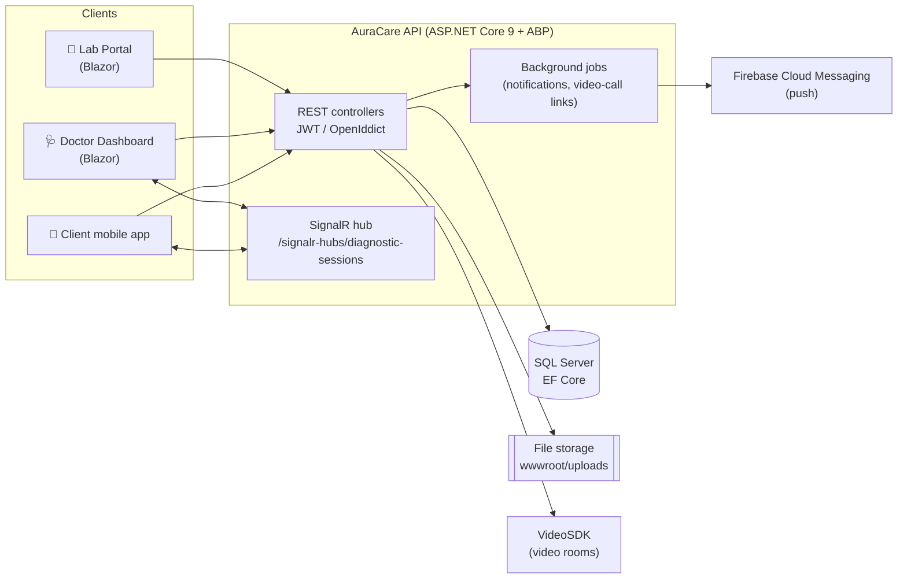
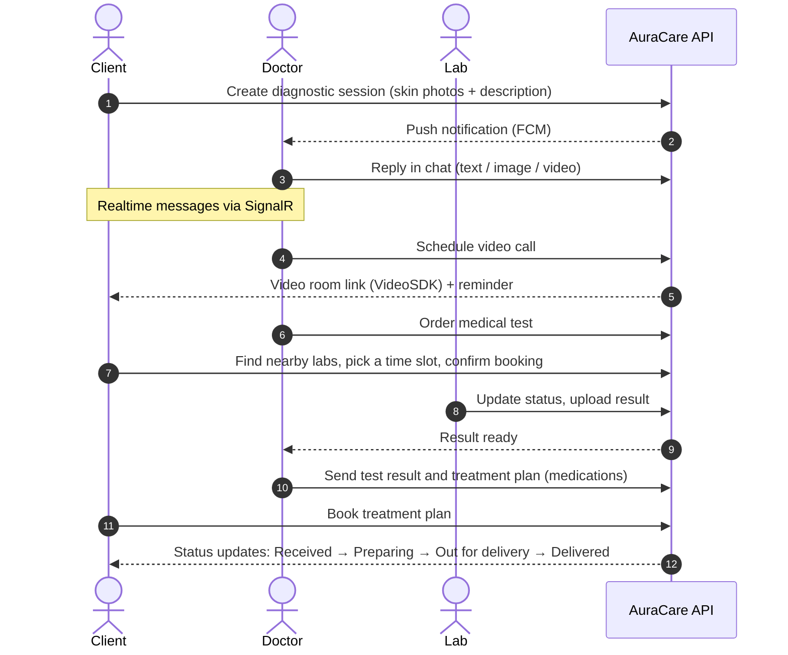
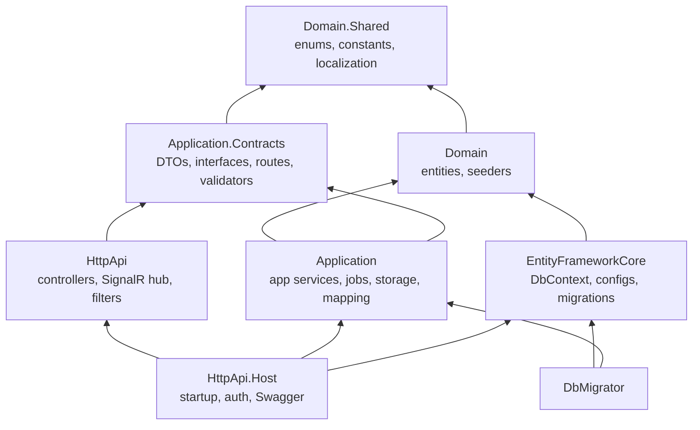
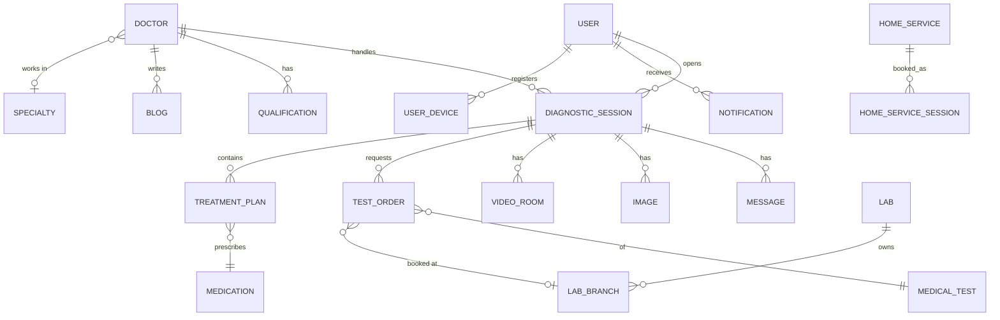
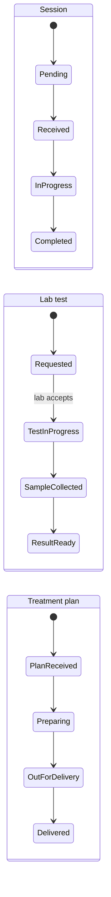

<div align="center">

# 🌿 AuraCare

**A tele-dermatology platform: chat with skin doctors, get tested at partner labs, and receive a treatment plan, all in one place.**


</div>

---

## ⚡ TL;DR

| | |
| --- | --- |
| **What it is** | Backend API + 2 web dashboards for skin-care consultations |
| **Who uses it** | 👤 Clients · 🩺 Doctors · 🧪 Labs · 🛠 Admins |
| **Core flow** | Client opens a session → chats / video-calls a doctor → doctor orders tests → lab uploads results → doctor sends a treatment plan |
| **Stack** | ASP.NET Core 9 · ABP Framework 9 · EF Core · SQL Server · SignalR · Blazor · Firebase · VideoSDK |
| **Run it** | `docker compose up --build` (see [Quick Start](#-quick-start)) |

---

## 🧩 What's inside

| App | Path | Port | Purpose |
| --- | --- | --- | --- |
| **API** | `src/AuraCare.HttpApi.Host` | `8080` | REST API, Swagger, SignalR hub, auth server |
| **Doctor Dashboard** | `src/AuraCare.Blazor.DoctorDashboard` | `8081` | Doctors: sessions, patients, blogs, scheduled video calls, test orders |
| **Lab Portal** | `src/AuraCare.Lab` | `8082` | Labs: incoming test orders, results upload, schedule, tests catalog |
| **DB Migrator** | `src/AuraCare.DbMigrator` | – | Applies migrations and seeds initial data |

---

## 🗺 System overview



---

## 🔄 Core flow: from consultation to treatment



---

## 👥 Roles

| Role | Can do |
| --- | --- |
| 👤 **CLIENT** | Register with OTP, open sessions, chat, join video calls, book labs / home services / treatment plans, rate doctors |
| 🩺 **DOCTOR** | Manage schedule, answer sessions, order tests, build treatment plans, write blogs, manage qualifications |
| 🧪 **LAB** | Manage branches, schedule and tests catalog, process orders, upload results |
| 🛠 **ADMIN** | Manage pages (terms / about / privacy), medications, and moderate content |

---

## ✨ Features

- 🔐 **Auth**: phone or email + OTP, JWT access tokens (30 min) with refresh tokens, forgot / change password flows
- 💬 **Realtime chat** per session: text, image, video, files, treatment plans, test results, booking confirmations
- 🎥 **Video consultations** through VideoSDK rooms (reserved → started → ended / cancelled)
- 🧪 **Lab testing**: test catalog by category and sample type, nearby labs, time-slot booking, home sample collection or lab visit, result upload
- 💊 **Treatment plans**: doctor builds a medication list; client books it and tracks delivery
- 🏠 **Home services**: providers, schedules, and bookings
- ⭐ **Doctor ratings**, qualifications, specialties, and a moderated **blog** (Pending / Published / Rejected)
- 🔔 **Push notifications** with Firebase (multi-device, per-user toggle)
- 📚 **Content pages** (Terms, About, Privacy) and a skin-conditions library
- 🌐 **Localization** resources and a configurable Swagger split per audience

---

## 🏗 Architecture

Clean, layered ABP solution. Each arrow means "depends on".



<details>
<summary><b>📁 Folder structure</b></summary>

```
AuraCare/
├── src/
│   ├── AuraCare.Domain.Shared/        # enums, error codes, localization
│   ├── AuraCare.Domain/               # entities + data seeders
│   ├── AuraCare.Application.Contracts/# DTOs, service interfaces, ApiRoutes
│   ├── AuraCare.Application/          # business logic, jobs, storage service
│   ├── AuraCare.EntityFrameworkCore/  # DbContext, entity configs, migrations
│   ├── AuraCare.HttpApi/              # controllers, SignalR hub
│   ├── AuraCare.HttpApi.Host/         # API entry point (Dockerfile inside)
│   ├── AuraCare.HttpApi.Client/       # typed API client proxies
│   ├── AuraCare.DbMigrator/           # migrate + seed (Dockerfile inside)
│   ├── AuraCare.Blazor.DoctorDashboard/
│   └── AuraCare.Lab/
├── test/                              # unit / integration test projects
├── docker-compose.yml
└── .github/workflows/staging.yml      # CI/CD to the staging server
```
</details>

---

## 🗃 Data model (simplified)



---

## 🚀 Quick Start

### Option A: Docker (recommended)

```bash
git clone https://github.com/<your-username>/AuraCare.git
cd AuraCare

# 1) create your local config from the example
cp src/AuraCare.HttpApi.Host/appsettings.example.json src/AuraCare.HttpApi.Host/appsettings.json
#    ...then fill the values listed in "Configuration" below

# 2) build and start everything
docker compose up --build
```

| Service | URL |
| --- | --- |
| API + Swagger | http://localhost:8080/swagger |
| Doctor Dashboard | http://localhost:8081 |
| Lab Portal | http://localhost:8082 |

### Option B: Run locally

**Prerequisites:** .NET SDK 9 · SQL Server · Node.js (for ABP client libs)

```bash
dotnet restore

# create the database + seed data
dotnet run --project src/AuraCare.DbMigrator

# start the API
dotnet run --project src/AuraCare.HttpApi.Host
```

Open **Swagger** and pick an API group: *Shared, Admin, Client, Doctor, Lab*.

---

## ⚙️ Configuration

Set these in `appsettings.json`, **user-secrets**, or environment variables. Never commit real values.

| Section | Keys | Notes |
| --- | --- | --- |
| `ConnectionStrings` | `Default` | SQL Server connection string |
| `App` | `SelfUrl`, `ClientUrl`, `CorsOrigins`, `RedirectAllowedUrls` | Public URLs of the API and clients |
| `AuthServer` | `Authority`, `RequireHttpsMetadata`, `SwaggerClientId`, `CertificatePassPhrase` | OpenIddict settings |
| `Jwt` | `Key`, `Issuer`, `Audience`, `ExpireInMinutes` | Use a long random key (32+ chars) |
| `Otp` | `TtlInMinutes`, `MaxTry`, `MaxResend` | Defaults: 5 / 3 / 3 |
| `Storage` | `BaseUrl` | Base URL used to build uploaded-file links |
| `VideoSdk` | `ApiKey`, `SecretKey`, `ApiBaseUrl` | From your VideoSDK account |
| `StringEncryption` | `DefaultPassPhrase` | ABP encryption passphrase |

**Also required (not in appsettings):**
- 🔔 A **Firebase service-account JSON** for push notifications
- 🔑 An **OpenIddict certificate (`.pfx`)** for token signing in production

---

## 📡 API map

All endpoints live under `api/v1/` and are grouped by audience in Swagger.

| Area | Base route | Highlights |
| --- | --- | --- |
| **Auth** | `auth/` | `login`, `refresh-token`, `send-otp`, `verify-otp`, `forget-password`, `change-password`, `my-info`, `logout` |
| **Client** | `client/` | `register`, `diagnostic-session-tests/` (`nearby-labs`, `available-slots`, `{id}/confirm-booking`) |
| **Sessions** | `diagnostic-sessions/` | create, list, `{id}/messages`, `{id}/full-details`, `book-treatment-plan` |
| **Doctor sessions** | `doctor/diagnostic-sessions/` | `messages`, `tests`, `add-treatment-item`, `{id}/send-treatment-plan`, `send-test-result` |
| **Doctors** | `doctors/` | list, `specialties`, `{id}/schedules` |
| **Ratings** | `doctor-ratings/` | create, `doctor/{doctorId}`, `{id}/complete` |
| **Blogs / Qualifications** | `doctor/blogs/`, `doctor/qualifications/` | CRUD + `{id}/status` moderation |
| **Labs** | `lab/` | `branches/`, `schedules/`, `medical-tests/`, `diagnostic-session-tests/` (`orders`, `{id}/upload-result`) |
| **Medical tests** | `medical-tests/` | `categories`, `categories/{id}/tests`, `sample-types` |
| **Home services** | `home-services/`, `home-service-providers/`, `home-service-sessions/` | list, providers, schedules, bookings |
| **Content** | `pages/`, `skin-conditions/`, `medications/` | Terms / About / Privacy, conditions library, medication catalog |
| **Notifications** | `notifications/` | `register-device`, `toggle`, `{id}/read` |
| **Realtime** | `/signalr-hubs/diagnostic-sessions` | `JoinSessionGroupAsync`, `LeaveSessionGroupAsync` (JWT required) |

---

## 🔁 Session lifecycle



---

## 🚢 Deployment

`.github/workflows/staging.yml` deploys on every push to the **`staging`** branch:

1. SSH into the server
2. Pull the latest code
3. Run `db-migrator`, then rebuild `abpapp`, `doctor-dashboard`, and `lab-blazor` with Docker Compose
4. Prune unused images

Required GitHub **secrets**: `SSH_HOST_STAGING`, `SSH_USER_STAGING`, `SSH_PRIVATE_KEY_STAGING`.

---

## 🧪 Tests

```bash
dotnet test
```

Test projects: `Application.Tests`, `Domain.Tests`, `EntityFrameworkCore.Tests`, plus a console API-client demo. The current tests are mostly ABP template samples and are a good place to start contributing.

---

## ⚠️ Known issues & notes

| Topic | Detail |
| --- | --- |
| **Database mismatch** | EF Core is configured for **SQL Server**, but `docker-compose.yml` and `appsettings.example.json` target **PostgreSQL**. Pick one provider and align them. |
| **Hangfire** | Packages are referenced, but job scheduling in `DoctorScheduleService` is still a placeholder. |
| **Secrets** | Credentials must live outside Git (see [Configuration](#️-configuration)). |
| **Target frameworks** | Backend is .NET 9; the Blazor apps currently target .NET 8. |

---

## 🛣 Roadmap

- [ ] Finish Hangfire scheduling for appointment reminders
- [ ] Align the database provider across code, Docker and docs
- [ ] Payments for treatment plans and lab bookings
- [ ] Real test coverage for the application services
- [ ] Production CI pipeline (build, test, deploy)

---

## 🤝 Contributing

1. Fork the repo and create a branch: `git checkout -b feature/my-feature`
2. Commit your changes: `git commit -m "feat: add my feature"`
3. Push and open a Pull Request

---

<div align="center">

Built with ❤️ for better skin care · **AuraCare**

</div>
